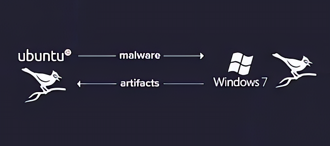

I decided to create similar product like [VirusTotal](https://virustotal.com) . 

User will upload any file to [platfrom](http://ransomaware.xyz) that can be normal or malware file , then file/exe will excuted in virtual machine and cuckoo sandbox will generate behavioral analysis (activities, apicall's or system call by that exe file) and this analysis act as feature set for ML model and it will predict it is ransomware or normal file also provide log and dynamic analysis data . 

# Architecture 
Architecture we are goin to implement / follow 

So from above image we understand user will upload file , we check hash will our signautre repositry (contain hash of multiple malware ) and it will proceed to Dynamic analyisi . which means file will be executed inside a VM machine and [cuckoo sandbox](https://cuckoosandbox.org/) will observe the activities of file/malware and generate the [report](https://cuckoo.sh/docs/usage/api.html#tasks-report) in JSON format .

After analyzing file cuckoo sandbox generate report in JSON format . Sample [report.json](report.json) file   

# About ML mode 

In architecture we saw there are two ML model 

1st model is Deep learning model to detect weather file is ransomware or not . 
How does it do that ?
step1 : Above we saw that we get one report.json file from cuckoo sandbox ,we convert that report.json file into numpy matrix / format  . 
step 2 : Now passsing that numpy to deeplearning model .

Creating Deep Learning model 
[working Collab Notebook](https://colab.research.google.com/drive/1JW_ZLHefwDismh74Qe_8k5bews9u94YV?usp=sharing)  (Here i used small dataset to train model)

One of researcher share a huge 13GB dataset with me , click on [link](https://www.dropbox.com/s/p3upyzbhkuh6gnf/Archive.zip?dl=0) 

Paper reference of model [https://arxiv.org/pdf/1907.07352.pdf](https://arxiv.org/pdf/1907.07352.pdf) 

2nd Model 

Its a very simple random forest model which classify the ransomware family (out of 5 families ). 
Here is [code](https://github.com/Rmayalam/Ransomware_Paranoia) 
Researcher paper : [https://ieeexplore.ieee.org/document/9536608](https://ieeexplore.ieee.org/document/9536608) 

# Additional thing to do 
we can have chatbot based on langchang/ LAAMA INDEX so that we can chat with context to Report of file analysis .like we can ask question like "does my file delete any of file after execution ?" , "which type of malware it is ?" , "which IP address it calls after execution ? " etc . 
 
For additional information we can use VirusTotal API's to get general information of file . 

# Cuckoo Sandbox Installation video
I am aware that cuckoo sandbox is difficult to install due to huge dependency so i recorded the video for referance . 

{}
Watch Cuckoo Sandbox Installation by clicking on Image 👇👇👇
{}

<!--  -->

### Referance Paper1 
Link of paper1 [https://ieeexplore.ieee.org/document/9536608](https://ieeexplore.ieee.org/document/9536608)

Paper In short : It classify the type of ransomeware family (out of 5 family used to train model ) from doing dynamic analysisi or observing paranoia activity / API calls . 

### Referance Paper 2
Link of paper [https://doi.org/10.1016/j.jksuci.2020.06.012](https://doi.org/10.1016/j.jksuci.2020.06.012)

We can also explore the hybrid approch i.e static and dynamic analysis to find ransomeware and then identify it's family . 