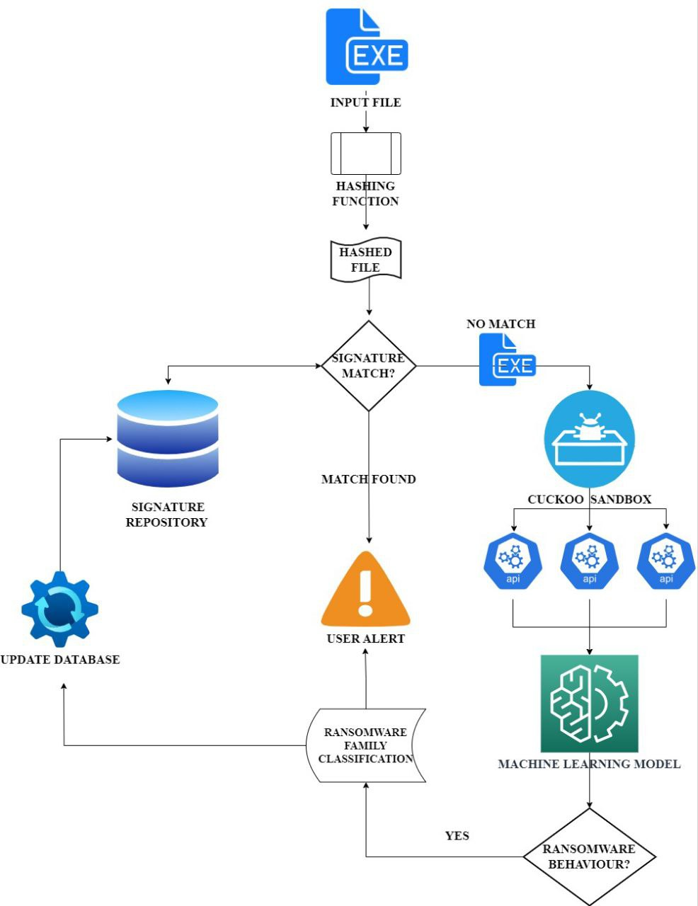

While doing Research our Guide share two paper related to this approach . 

### Paper1 
Link of paper1 [https://ieeexplore.ieee.org/document/9536608](https://ieeexplore.ieee.org/document/9536608)

Paper In short : It classify the type of ransomeware family (out of 5 family used to train model ) from doing dynamic analysisi or observing paranoia activity / API calls . 

### Paper 2
Link of paper [https://doi.org/10.1016/j.jksuci.2020.06.012](https://doi.org/10.1016/j.jksuci.2020.06.012)

Architecture we are goin to implement / follow 

We can also explore the hybrid approch i.e static and dynamic analysis to find ransomeware and then identify it's family . 